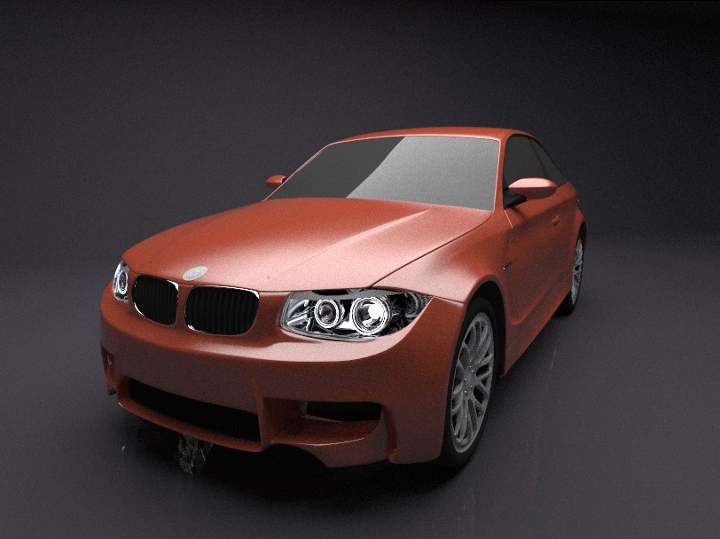
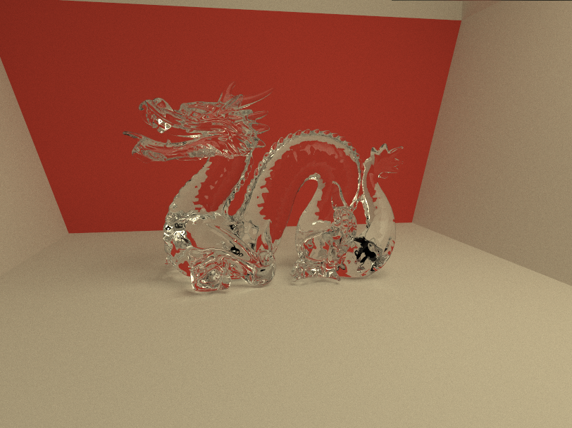
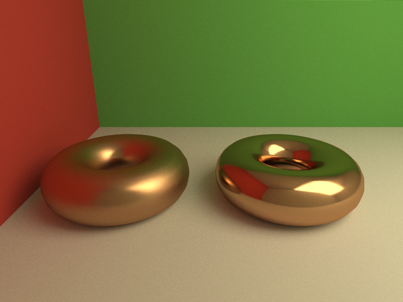
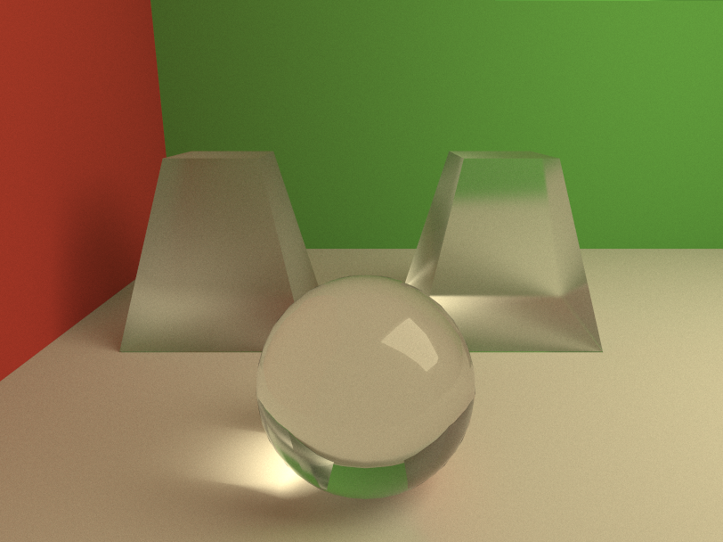
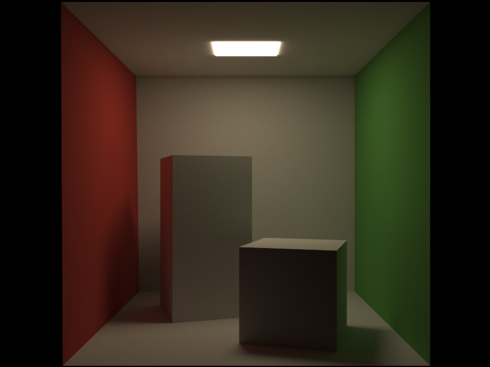

# GPU Accelerated CUDA Ray-Tracer Project
During the 3rd year of my course at the University of Surrey, I created a GPU Accelerated CUDA-based ray-tracer from scratch. The primary purpose of the project was for my own education into GPU accelerated computing and to gain a more comprehensive understanding of realistic rendering methods. 

The final ray-tracer makes use of hard-coded BRDFs implemented using a Monte Carlo path tracing algorithm. The implementation is accelerated to logarithmic complexity by use of a Bounding Volume Hierarchy (BVH) acceleration structure. The final implementation has no texturing or denoising support, however the final results are comparable in rendering time and complexity with current industry standards (Blender Cycles, Luxrender tested). More complex path tracing algorithms such as Nvidia's Gradient Domain Path tracing were subject to research in the project report, but are not implemented in the final project.

## Images
The following are a selected set of output images from the ray-tracer.

## Project Report
The full project report is available upon request, as this work was produced as part of my education at the University of Surrey its contents may be protected under agreements made upon enrolling.
